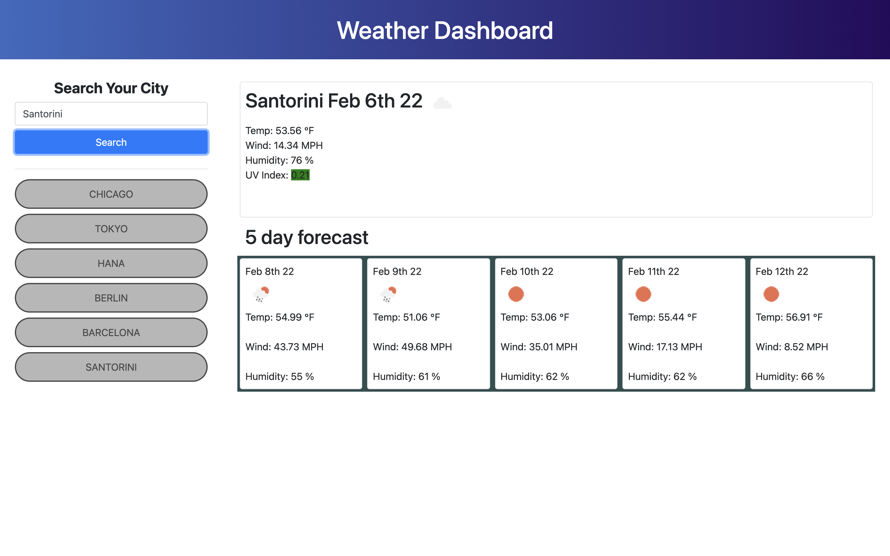

# hw6#

## Description

This is a weather dashboard that displays the temperature, wind speed, humidity, and UV index of any given city. The site is uses Javascript too pull data from an API and display that data to the page

## Technologies Used

-   HTML
-   Javascript
-   Bootstrap CSS
-   CSS
-   OpenWeatherMap API

## Screenshot

## Links to Application

-   Here is the repo: [hw6 GitHub Repo](https://github.com/Jonchirinos/hw6)
-   Here is the pages: [hw6 Page](https://jonchirinos.github.io/hw6/)
